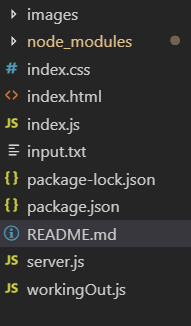
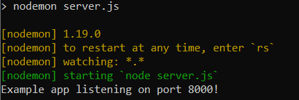
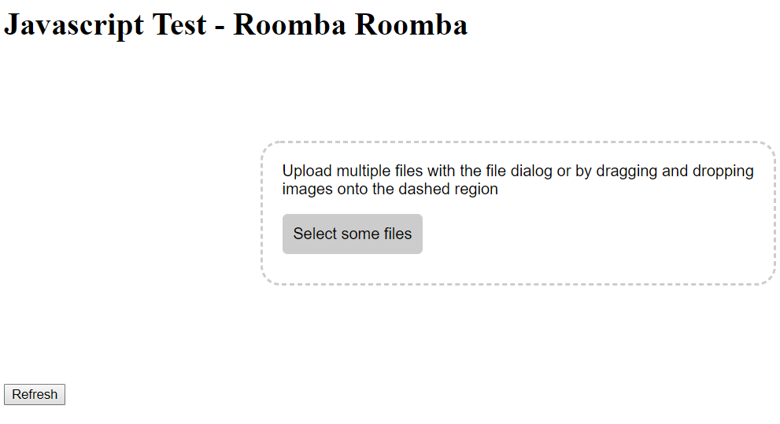
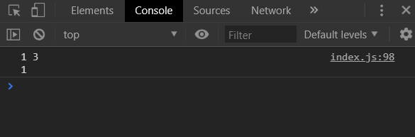

# Javascript Test - Roomba Roomba
Javascript test to write a program that will run an imaginary robotic hoover in a 5x5 room

## Getting Started
Clone the repository and run ` npm i ` to install all the packages and dependacies

```
git clone https://github.com/itzcookiie/Javascript-Test.git
```
```
npm i
```

## Deliverables
- Web page application
- Runs on the browser
- Written using javascript and nodejs

## Folder structure



- workingOut.js - shows original working out before final solution. The non-refactored version of index.js
- index.js - shows final solution with comments to show what each part of the file does and where everything is
- index.html - the file that is displayed on localhost which contains and renders index.js
- server.js - file containing nodejs. Handles the back end of the application
- input.txt - file containing all the information regarding the hoover (programmable input)
- index.css - css file for the drag and drop in index.js

## Setting up

To set up the program run in the terminal
``` 
npm run dev 
```
You should see this



## Running the program

Go to http://localhost:8000/. The page should look like this.



## The input file

Take a look at the input.txt file. The input.txt file holds all the information for the room, hoover and coordinates for dirt. The format is as follows:
```
5 5     1. Room dimensions
1 2     2. Initial coordinates
1 0     |
2 2     |  3. Lines with pipe are coordinates with dirt
2 3     |
NNESEESWNWWEN      4. Cardinal directions for hoover to follow
```


5 5 represents a coordinate of X:5 and Y:5. Following this format and the order, you can change any of the coordinate positions and add as many coordinates of dirt and as many directions. Just edit the input file with your changes and save it. 


## The console
Open the dev tools and look at the console. The console shows the output for running the program. It should look like this



The first line represents the **final coordinate position** of the hoover
```
1 3
```

The second line represents the **amount of dirt picked up by the hoover** from its inital position to its final position
```
1
```

## Updating the input file

To see the updated final position and total dirt collected **save the changes to the input.txt file** and then: 
- refresh the page after 
- click on the trigger button
- drag the file from the folder into the drag and drop area

The results will show in the console. 

*Bear in mind, it may take a little while for the results to show if you click the trigger button as it is performing a hidden refresh without reloading the whole page.*